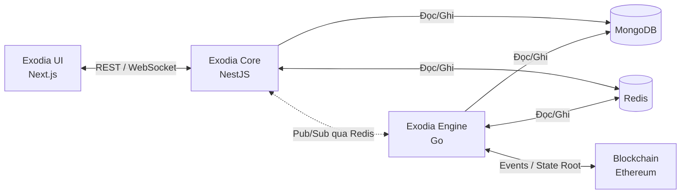

# ⚔️ Exodia Core

**Backend API cho sàn giao dịch web3 phái sinh (Web3 Perpetual Exchange).**

Exodia Core là lớp API trung tâm được xây dựng bằng NestJS, đóng vai trò cầu nối giữa giao diện người dùng và hệ thống xử lý giao dịch. Exodia Core chịu trách nhiệm nhận lệnh từ frontend, xác thực chữ ký EIP-712, kiểm tra margin, quản lý ví, và đồng bộ dữ liệu real-time với Exodia Engine thông qua Redis.

> **Đây là 1 trong 4 thành phần** chính của Exodia. README này tập trung vào **Exodia Core**.

---

## 📋 Mục Lục

- [Cấu Trúc Dự Án Exodia](#-cấu-trúc-dự-án-exodia)
- [Kiến Trúc Tổng Quan](#-kiến-trúc-tổng-quan)
- [Vai Trò Của Exodia Core](#-vai-trò-của-exodia-core)
- [Công Nghệ Sử Dụng](#-công-nghệ-sử-dụng)
- [Yêu Cầu Hệ Thống](#-yêu-cầu-hệ-thống)
- [Cài Đặt & Chạy](#-cài-đặt--chạy)
- [Cấu Trúc Thư Mục](#-cấu-trúc-thư-mục)
- [API Reference](#-api-reference)
- [Cách Sử Dụng API](#-cách-sử-dụng-api)
- [Rate Limiting](#-rate-limiting)
- [Xác Thực EIP-712](#-xác-thực-eip-712)
- [Testing](#-testing)
- [Tài Liệu Kỹ Thuật](#-tài-liệu-kỹ-thuật)

---

## 🌐 Cấu Trúc Dự Án Exodia

| Repository                                                           | Công nghệ | Vai trò                                                                    |
| -------------------------------------------------------------------- | --------- | -------------------------------------------------------------------------- |
| [**Exodia UI**](https://github.com/anotherath/exodia-ui)             | Next.js   | Giao diện người dùng — hiển thị biểu đồ, đặt lệnh, quản lý ví              |
| [**Exodia Core**](https://github.com/anotherath/exodia-core)         | NestJS    | API Backend — xác thực, quản lý lệnh, kết nối DB _(repo hiện tại)_         |
| [**Exodia Engine**](https://github.com/anotherath/exodia-engine)     | Go        | Trading Engine — khớp lệnh, tính PnL, quét thanh lý, gom state root        |
| [**Exodia Contract**](https://github.com/anotherath/exodia-contract) | Solidity  | Smart Contracts trên Ethereum — nạp/rút tiền, staking, xác thực state root |

---

## 🏗️ Kiến Trúc Tổng Quan



### Luồng dữ liệu giữa các thành phần:

```
📥 Nạp tiền:
   User → Exodia Contract (deposit) → Blockchain Event
   → Exodia Engine lắng nghe → Cập nhật MongoDB & Redis → Exodia Core phản ánh số dư mới

📤 Rút tiền:
   User → Exodia Core (yêu cầu rút) → Exodia Engine gom vào State Root
   → Exodia Engine đẩy State Root lên Blockchain (định kỳ)
   → Exodia Contract xác thực → Cho phép rút

📈 Mở lệnh Market:
   User ký EIP-712 → Exodia UI gửi đến Exodia Core → Exodia Core xác thực & validate margin
   → Exodia Core ghi MongoDB + đồng bộ Redis → Exodia Engine nhận event → Theo dõi PnL

📊 Dữ liệu Real-time:
   Exodia Engine tính PnL/Margin liên tục → Ghi vào Redis
   → Exodia Core đọc Redis khi cần → Trả về cho Exodia UI qua REST/WebSocket
```

---

## 🎯 Vai Trò Của Exodia Core

Exodia Core là **API Gateway** — lớp trung gian xử lý mọi tương tác giữa người dùng và hệ thống:

| Trách nhiệm                     | Chi tiết                                                             |
| ------------------------------- | -------------------------------------------------------------------- |
| **Xác thực giao dịch**          | Verify chữ ký EIP-712, kiểm tra nonce (dùng 1 lần, hết hạn 2 phút)   |
| **Validate Margin**             | Kiểm tra số dư khả dụng trước khi mở lệnh (Redis → MongoDB fallback) |
| **Quản lý lệnh**                | Tạo/sửa/hủy Market Order, Limit Order                                |
| **Quản lý vị thế**              | Theo dõi, cập nhật SL/TP, đóng vị thế                                |
| **Quản lý ví**                  | Truy vấn số dư, chuyển tiền giữa Main Wallet ↔ Trade Balance         |
| **Cung cấp dữ liệu thị trường** | Cache & phục vụ dữ liệu nến từ OKX                                   |
| **Đồng bộ Redis**               | Ghi vị thế/lệnh mới lên Redis để Exodia Engine xử lý real-time       |
| **Rate Limiting**               | Chặn spam API theo 2 lớp (IP + Wallet)                               |

### Exodia Core KHÔNG làm:

- ❌ Khớp lệnh Limit (Exodia Engine làm)
- ❌ Tính PnL real-time (Exodia Engine làm)
- ❌ Quét thanh lý (Exodia Engine làm)
- ❌ Gom state root (Exodia Engine làm)
- ❌ Xử lý nạp/rút on-chain (Exodia Contract làm)

---

## 🛠️ Công Nghệ Sử Dụng

| Công nghệ              | Phiên bản | Vai trò                               |
| ---------------------- | --------- | ------------------------------------- |
| **NestJS**             | 11.x      | Framework chính                       |
| **TypeScript**         | 5.x       | Ngôn ngữ lập trình                    |
| **MongoDB** + Mongoose | 9.x       | Cơ sở dữ liệu chính (Source of Truth) |
| **Redis** + ioredis    | 5.x       | Cache, Pub/Sub, Distributed Lock      |
| **Socket.IO**          | 4.x       | WebSocket real-time                   |
| **Swagger**            | 11.x      | Tài liệu API tự động                  |
| **Viem**               | 2.x       | Xác thực chữ ký EIP-712               |
| **Jest**               | 30.x      | Unit Testing                          |

---

## 📦 Yêu Cầu Hệ Thống

- **Node.js** >= 18
- **Docker** & **Docker Compose** (cho MongoDB + Redis)
- **npm** >= 9

---

## 🚀 Cài Đặt & Chạy

### 1. Clone & cài đặt dependencies

```bash
git clone https://github.com/anotherath/exodia-core.git
cd exodia-core
npm install
```

### 2. Cấu hình biến môi trường

Dự án sử dụng file `.env` để quản lý các cấu hình. Bạn cần tạo file này từ template:

```bash
cp .env.example .env
```

Sau đó, mở file `.env` và cập nhật các thông tin sau:

- `MONGO_ROOT_USER`: Tên đăng ký admin cho MongoDB.
- `MONGO_ROOT_PASSWORD`: Mật khẩu cho MongoDB.
- `MONGODB_URI`: Cập nhật lại chuỗi kết nối khớp với user/pass vừa đặt.

> **Lưu ý quan trọng:** Bạn **PHẢI** thiết lập `username` và `password` của riêng bạn trong file `.env` trước khi khởi động Docker.

### 3. Khởi động MongoDB & Redis

Sau khi đã cấu hình xong file `.env`, hãy chạy:

```bash
docker compose up -d
```

Lệnh này sẽ khởi động MongoDB và Redis dưới dạng container ngầm (`detached mode`).

### 4. Chạy ứng dụng

```bash
# Development (hot-reload)
npm run start:dev

# Production
npm run build
npm run start:prod
```

Server sẽ chạy tại: **http://localhost:3000**

### 5. Truy cập Swagger UI

Mở trình duyệt và vào: **http://localhost:3000/api**
Tại đây có thể xem và thử tất cả API trực tiếp.

---

## 📂 Cấu Trúc Thư Mục

```
exodia-core/
├── src/
│   ├── config/                    # ⚙️ Cấu hình tập trung
│   │   ├── balance.config.ts      #    Độ chính xác số thập phân (18 decimals)
│   │   ├── mongodb.config.ts      #    URI kết nối MongoDB
│   │   ├── okx.config.ts          #    API OKX & khung nến hỗ trợ
│   │   ├── redis.config.ts        #    Host & Port Redis
│   │   └── throttler.config.ts    #    Giới hạn Rate Limit cho từng API
│   │
│   ├── infra/                     # 🔌 Hạ tầng (Database Adapters)
│   │   ├── mongodb/               #    Kết nối & schema MongoDB
│   │   └── redis/                 #    Kết nối Redis & WebSocket adapter
│   │
│   ├── modules/                   # 📦 Các module nghiệp vụ
│   │   ├── market/                #    Dữ liệu thị trường (nến, giá)
│   │   ├── nonce/                 #    Quản lý Nonce cho EIP-712
│   │   ├── pair/                  #    Danh sách cặp giao dịch
│   │   ├── position/              #    Mở/đóng/sửa lệnh & vị thế
│   │   ├── user/                  #    Kích hoạt người dùng
│   │   └── wallet/                #    Quản lý ví & số dư
│   │
│   ├── repositories/              # 💾 Lớp truy cập dữ liệu
│   │   ├── cache/                 #    Redis repositories
│   │   ├── wallet/                #    MongoDB wallet repository
│   │   └── position/              #    MongoDB position repository
│   │
│   ├── shared/                    # 🔧 Code dùng chung
│   │   ├── filters/               #    Exception filters (Rate Limit 429, ...)
│   │   ├── types/                 #    TypeScript interfaces & types
│   │   └── utils/                 #    Hàm tiện ích (math, web3, ...)
│   │
│   ├── app.module.ts              # Module gốc — khai báo tất cả module & guard
│   └── main.ts                    # Entry point — bootstrap NestJS, Swagger, Redis adapter
│
├── docs/                          # 📚 Tài liệu kỹ thuật chi tiết
├── docker-compose.yml             # 🐳 MongoDB + Redis containers
└── package.json
```

---

## 📡 API Reference

### 🔐 Nonce — `/nonce`

| Method | Endpoint                               | Mô tả                                                                                         |
| ------ | -------------------------------------- | --------------------------------------------------------------------------------------------- |
| `GET`  | `/nonce/get-nonce?walletAddress=0x...` | Lấy mã nonce để ký giao dịch EIP-712. Mỗi nonce có hiệu lực **2 phút** và chỉ dùng **1 lần**. |

---

### 💰 Orders — `/orders`

| Method   | Endpoint                              | Mô tả                                         |
| -------- | ------------------------------------- | --------------------------------------------- |
| `POST`   | `/orders/market`                      | Mở lệnh Market — khớp ngay tại giá thị trường |
| `POST`   | `/orders/limit`                       | Mở lệnh Limit — chờ giá chạm mới khớp         |
| `PUT`    | `/orders/:id`                         | Chỉnh sửa lệnh Limit đang chờ (giá, SL/TP)    |
| `DELETE` | `/orders/:id`                         | Hủy lệnh Limit đang chờ                       |
| `GET`    | `/orders/open?walletAddress=0x...`    | Lấy danh sách lệnh đang chờ của ví            |
| `GET`    | `/orders/history?walletAddress=0x...` | Lấy lịch sử lệnh đã đóng hoặc đã hủy          |

---

### 📈 Positions — `/positions`

| Method | Endpoint                                 | Mô tả                                           |
| ------ | ---------------------------------------- | ----------------------------------------------- |
| `GET`  | `/positions?walletAddress=0x...`         | Lấy các vị thế đang mở                          |
| `GET`  | `/positions/:id`                         | Lấy chi tiết một vị thế                         |
| `PUT`  | `/positions/:id`                         | Cập nhật vị thế (đòn bẩy, SL/TP, đóng một phần) |
| `POST` | `/positions/:id/close`                   | Đóng vị thế toàn phần                           |
| `GET`  | `/positions/history?walletAddress=0x...` | Lấy lịch sử các vị thế đã đóng                  |

---

### 📊 Market — `/market`

| Method | Endpoint                                           | Mô tả                  |
| ------ | -------------------------------------------------- | ---------------------- |
| `GET`  | `/market/candles?instId=BTC-USDT&bar=1m&limit=100` | Lấy dữ liệu nến K-line |

Khung nến hỗ trợ: `1m`, `5m`, `15m`, `30m`, `1h`, `4h`, `1D`, `1W`, `1M`

---

### 👤 User — `/user`

| Method | Endpoint                                      | Mô tả                                    |
| ------ | --------------------------------------------- | ---------------------------------------- |
| `GET`  | `/user/get-active-status?walletAddress=0x...` | Kiểm tra trạng thái kích hoạt            |
| `POST` | `/user/post-active-user`                      | Kích hoạt người dùng bằng chữ ký EIP-712 |

---

### 💳 Wallet — `/wallet`

| Method | Endpoint                                | Mô tả                                      |
| ------ | --------------------------------------- | ------------------------------------------ |
| `GET`  | `/wallet?walletAddress=0x...&chainId=1` | Lấy thông tin ví và số dư                  |
| `POST` | `/wallet/deposit-trade`                 | Chuyển tiền từ Main Wallet → Trade Balance |
| `POST` | `/wallet/withdraw-trade`                | Chuyển tiền từ Trade Balance → Main Wallet |

> **Lưu ý:** Deposit/Withdraw ở đây là chuyển **nội bộ** giữa Main Wallet và Trade Balance, không phải nạp/rút on-chain. Việc nạp/rút on-chain được xử lý bởi Exodia Contract trên Ethereum.

---

### 🔧 Pairs — `/pairs`

| Method | Endpoint        | Mô tả                      |
| ------ | --------------- | -------------------------- |
| `GET`  | `/pairs`        | Lấy tất cả cặp giao dịch   |
| `GET`  | `/pairs/active` | Lấy các cặp đang hoạt động |

---

## 📖 Cách Sử Dụng API

### Luồng cơ bản: Mở lệnh Market (Long BTC)

#### Bước 1: Lấy Nonce

```bash
GET /nonce/get-nonce?walletAddress=0xABC123...
```

```json
{
  "nonce": "0xa1b2c3d4e5f6..."
}
```

#### Bước 2: Ký bản tin EIP-712 trên Frontend

Frontend dùng nonce vừa nhận để tạo bản tin EIP-712, sau đó yêu cầu người dùng ký bằng ví (MetaMask, WalletConnect, ...).

#### Bước 3: Gửi lệnh

```bash
POST /orders/market
Content-Type: application/json

{
  "walletAddress": "0xABC123...",
  "symbol": "BTC-USDT",
  "side": "long",
  "qty": 0.01,
  "leverage": 10,
  "stopLoss": 60000,
  "takeProfit": 72000,
  "typedData": { ... },
  "signature": "0x..."
}
```

Thành công:

```json
{
  "_id": "6654abc...",
  "walletAddress": "0xABC123...",
  "symbol": "BTC-USDT",
  "side": "long",
  "qty": 0.01,
  "entryPrice": 67500.25,
  "leverage": 10,
  "status": "open",
  "createdAt": "2026-02-24T00:00:00.000Z"
}
```

Margin không đủ:

```json
{
  "statusCode": 400,
  "message": "Không đủ số dư. Cần 68.175 USDT (Margin: 67.5 + Phí: 0.675). Khả dụng: 50.00 USDT"
}
```

#### Bước 4: Theo dõi vị thế

```bash
GET /positions?walletAddress=0xABC123...
```

#### Bước 5: Đóng vị thế

```bash
POST /positions/6654abc.../close
Content-Type: application/json

{
  "pnl": 125.50,
  "typedData": { ... },
  "signature": "0x..."
}
```

---

### Chuyển tiền nội bộ (Main Wallet ↔ Trade Balance)

```bash
# Chuyển từ Main sang Trade Balance để giao dịch
POST /wallet/deposit-trade
{
  "walletAddress": "0xABC123...",
  "chainId": 1,
  "amount": 1000
}

# Chuyển ngược lại từ Trade Balance về Main Wallet
POST /wallet/withdraw-trade
{
  "walletAddress": "0xABC123...",
  "chainId": 1,
  "amount": 500
}
```

---

### Lấy dữ liệu nến cho biểu đồ

```bash
# 200 nến 1 phút của BTC-USDT
GET /market/candles?instId=BTC-USDT&bar=1m&limit=200

# Phân trang: lấy nến trước một thời điểm
GET /market/candles?instId=BTC-USDT&bar=1h&limit=100&before=1708819200000
```

---

## 🛡️ Rate Limiting

Hệ thống sử dụng **2 lớp giới hạn** chạy đồng thời. Mỗi request phải vượt qua **cả 2 lớp** mới được xử lý:

| Lớp        | Tracker                       | Mục đích                    |
| ---------- | ----------------------------- | --------------------------- |
| **IP**     | Địa chỉ IP công cộng          | Chặn DDoS, bot cào dữ liệu  |
| **Wallet** | `walletAddress` (fallback IP) | Chặn spam giao dịch từ 1 ví |

### Giới hạn cho các API quan trọng:

| API                          | IP Limit     | Wallet Limit |
| ---------------------------- | ------------ | ------------ |
| Mở lệnh Market / Đóng vị thế | 10 / 10s     | **3 / 10s**  |
| Mở lệnh Limit / Sửa / Hủy    | 15 / 10s     | **5 / 10s**  |
| Lấy Nonce                    | **60 / 60s** | 60 / 60s     |
| Nạp / Rút (nội bộ)           | 15 / 60s     | **5 / 60s**  |
| Xem vị thế / lệnh            | 60 / 60s     | 30 / 60s     |
| Dữ liệu nến                  | **30 / 60s** | 30 / 60s     |
| Mặc định (global)            | 100 / 60s    | 100 / 60s    |

Khi vượt giới hạn:

```json
HTTP 429 Too Many Requests

{
  "success": false,
  "statusCode": 429,
  "message": "Bạn đang gửi quá nhiều yêu cầu, vui lòng thử lại sau",
  "error": "Too Many Requests"
}
```

Toàn bộ cấu hình rate limit tập trung tại: [`src/config/throttler.config.ts`](src/config/throttler.config.ts)

> Phân tích chi tiết rủi ro & chiến lược: [`docs/RATE_LIMITING.md`](docs/RATE_LIMITING.md)

---

## 🔑 Xác Thực EIP-712

Exodia **không dùng JWT hay session**. Mỗi hành động giao dịch được bảo vệ bằng **chữ ký số EIP-712**:

```
1. User gọi /nonce/get-nonce      → Nhận mã nonce (hết hạn sau 2 phút)
2. Frontend tạo bản tin EIP-712    → Chứa nonce + thông tin giao dịch
3. User ký bằng ví                 → MetaMask / WalletConnect / ...
4. Exodia Core xác thực chữ ký (viem) → Đúng người, đúng nội dung
5. Nonce bị xóa ngay              → Không thể replay
```

Mô hình này đảm bảo:

- ✅ **Không lưu mật khẩu** — xác thực bằng cryptography
- ✅ **Không thể giả mạo** — cần private key mới ký được
- ✅ **Không thể replay** — nonce dùng 1 lần, hết hạn 2 phút
- ✅ **Phi tập trung** — user giữ quyền kiểm soát ví của mình

---

## 🧪 Testing

```bash
# Chạy Unit Tests
npm test

# Chạy với coverage
npm run test:cov

# Chạy E2E Tests
npm run test:e2e
```

Hiện tại: **20 test suites — 158 tests** ✅

---

## 📚 Tài Liệu Kỹ Thuật

Các tài liệu chuyên sâu nằm trong thư mục [`docs/`](docs/):

| Tài liệu                                                                        | Nội dung                                        |
| ------------------------------------------------------------------------------- | ----------------------------------------------- |
| [`RATE_LIMITING.md`](docs/RATE_LIMITING.md)                                     | Phân tích rủi ro spam API & chiến lược giới hạn |
| [`TRADING_LOGIC_FORMULAS.md`](docs/TRADING_LOGIC_FORMULAS.md)                   | Công thức tính PnL, Margin, Liquidation Price   |
| [`IMPL_MARGIN_VALIDATION.md`](docs/IMPL_MARGIN_VALIDATION.md)                   | Chi tiết kiểm tra Margin trước khi mở lệnh      |
| [`REDIS_DATA_STRUCTURES.md`](docs/REDIS_DATA_STRUCTURES.md)                     | Tất cả Redis keys & data structures             |
| [`REDIS_IMPLEMENTATION.md`](docs/REDIS_IMPLEMENTATION.md)                       | Kế hoạch triển khai Redis theo giai đoạn        |
| [`CROSS_MARGIN_REDIS_ARCHITECTURE.md`](docs/CROSS_MARGIN_REDIS_ARCHITECTURE.md) | Kiến trúc Cross Margin với Redis                |
| [`CANDLE_HISTORY_CACHE.md`](docs/CANDLE_HISTORY_CACHE.md)                       | Chiến lược cache nến bằng Redis ZSET            |
| [`MARKET_CACHE_FLOW.md`](docs/MARKET_CACHE_FLOW.md)                             | Luồng cache dữ liệu thị trường                  |

---

## 📄 License

UNLICENSED — Private project.
