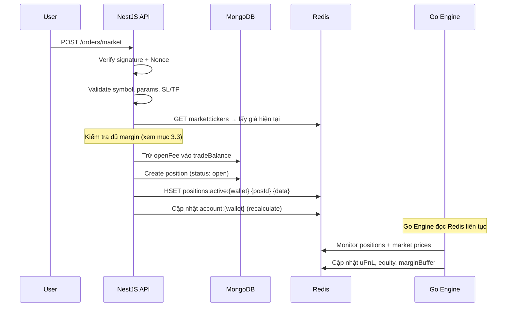
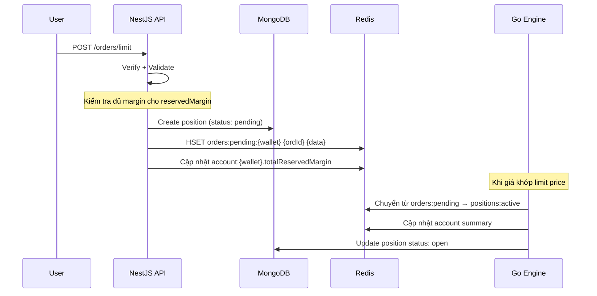
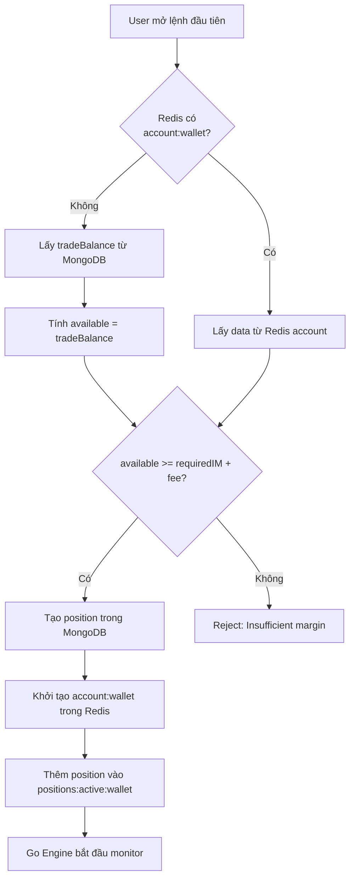
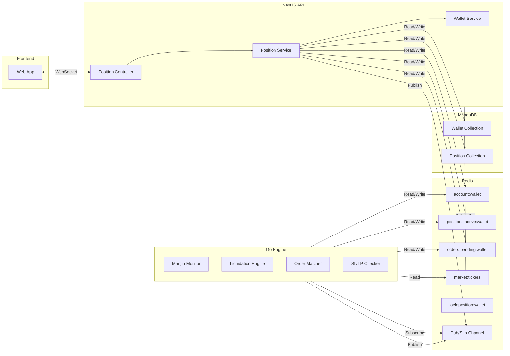

# Cross-Margin Redis Architecture — Exodia Core

Tài liệu thiết kế cấu trúc dữ liệu Redis cho hệ thống giao dịch Cross-Margin Perpetual Futures.
Bao gồm: cấu trúc key, luồng dữ liệu, các vấn đề tiềm ẩn, rủi ro, và giải pháp đề xuất.

---

## Mục lục

1. [Tổng quan Cross-Margin](#1-tổng-quan-cross-margin)
2. [Cấu trúc dữ liệu Redis](#2-cấu-trúc-dữ-liệu-redis)
3. [Luồng dữ liệu khi vào lệnh](#3-luồng-dữ-liệu-khi-vào-lệnh)
4. [Cold Start: Khi chưa có lệnh nào](#4-cold-start-khi-chưa-có-lệnh-nào)
5. [Vấn đề, Rủi ro & Giải pháp](#5-vấn-đề-rủi-ro--giải-pháp)
6. [Công thức tính toán](#6-công-thức-tính-toán)
7. [Luồng giao tiếp NestJS ↔ Go Engine](#7-luồng-giao-tiếp-nestjs--go-engine)

---

## 1. Tổng quan Cross-Margin

Trong chế độ **Cross-Margin**, toàn bộ số dư giao dịch (`tradeBalance`) được dùng làm **tài sản thế chấp chung (shared collateral)** cho tất cả các vị thế đang mở. Điều này có nghĩa:

- ✅ Lợi nhuận từ vị thế A bù đắp thua lỗ từ vị thế B
- ✅ Hiệu quả vốn cao hơn so với Isolated Margin
- ⚠️ **Rủi ro cao hơn**: một vị thế thua lỗ nặng có thể kéo thanh lý toàn bộ tài khoản

### Các chỉ số chính cần theo dõi real-time

| Chỉ số             | Mô tả                                                                           | Tần suất cập nhật         |
| ------------------ | ------------------------------------------------------------------------------- | ------------------------- |
| **Total Equity**   | Tổng tài sản tạm tính = `tradeBalance + Σ(Unrealized PnL)`                      | Real-time (mỗi tick giá)  |
| **Unrealized PnL** | PnL chưa thực hiện của từng vị thế đang mở                                      | Real-time (mỗi tick giá)  |
| **Margin Buffer**  | Số dư còn lại trước khi bị thanh lý = `Total Equity - Total Maintenance Margin` | Real-time                 |
| **Realized PnL**   | PnL đã thực hiện (đã cộng/trừ vào `tradeBalance`)                               | Khi đóng lệnh             |
| **Trade Balance**  | Số dư giao dịch trong MongoDB (source of truth)                                 | Khi đóng lệnh / nạp / rút |

---

## 2. Cấu trúc dữ liệu Redis

### 2.1 Account Summary (Tổng hợp tài khoản)

```
KEY:    account:{walletAddress}
TYPE:   Hash
TTL:    Không (persistent, xóa khi không còn vị thế nào)
```

| Field                    | Type                   | Mô tả                                                       |
| ------------------------ | ---------------------- | ----------------------------------------------------------- |
| `tradeBalance`           | string (number)        | Snapshot từ MongoDB, đồng bộ lúc mở lệnh đầu tiên           |
| `totalEquity`            | string (number)        | `tradeBalance + totalUnrealizedPnL`                         |
| `totalUnrealizedPnL`     | string (number)        | Tổng uPnL tất cả vị thế, cập nhật bởi Go Engine             |
| `totalMaintenanceMargin` | string (number)        | Tổng MM, dùng để check thanh lý                             |
| `totalInitialMargin`     | string (number)        | Tổng IM, dùng để check đủ margin mở lệnh mới                |
| `marginBuffer`           | string (number)        | `totalEquity - totalMaintenanceMargin`                      |
| `marginRatio`            | string (number)        | `totalMaintenanceMargin / totalEquity` (0~1, ≥1 = thanh lý) |
| `positionCount`          | string (number)        | Số lượng vị thế đang mở                                     |
| `updatedAt`              | string (ISO timestamp) | Thời điểm cập nhật cuối                                     |

> [!IMPORTANT]
> `tradeBalance` trong Redis chỉ là **snapshot**. Source of truth vẫn là MongoDB.
> Khi có lệnh đóng, `tradeBalance` trong Redis phải được đồng bộ lại từ MongoDB.

---

### 2.2 Active Positions (Vị thế đang mở)

```
KEY:    positions:active:{walletAddress}
TYPE:   Hash
```

| Field          | Value                               |
| -------------- | ----------------------------------- |
| `{positionId}` | `JSON.stringify(PositionRedisData)` |

```typescript
interface PositionRedisData {
  id: string;
  symbol: string;
  side: 'long' | 'short';
  type: 'market' | 'limit';
  qty: number;
  entryPrice: number;
  leverage: number;
  sl?: number | null;
  tp?: number | null;
  openFee: number;

  // Tính toán bởi Go Engine (cập nhật real-time)
  markPrice: number; // Giá mark hiện tại
  unrealizedPnL: number; // uPnL = (markPrice - entryPrice) * qty * side_multiplier
  initialMargin: number; // IM = (qty * entryPrice) / leverage
  maintenanceMargin: number; // MM = notionalValue * MMR
  liquidationPrice: number; // Giá thanh lý (tính bởi engine)

  createdAt: string; // ISO timestamp
  updatedAt: string; // ISO timestamp - Go engine cập nhật
}
```

---

### 2.3 Pending Orders (Lệnh chờ khớp)

```
KEY:    orders:pending:{walletAddress}
TYPE:   Hash
```

| Field       | Value                                   |
| ----------- | --------------------------------------- |
| `{orderId}` | `JSON.stringify(PendingOrderRedisData)` |

```typescript
interface PendingOrderRedisData {
  id: string;
  symbol: string;
  side: 'long' | 'short';
  type: 'limit';
  qty: number;
  entryPrice: number; // Giá đặt limit
  leverage: number;
  sl?: number | null;
  tp?: number | null;

  // Ký quỹ dự phòng cho lệnh limit
  reservedMargin: number; // (qty * entryPrice) / leverage + estimated open fee

  createdAt: string;
}
```

> [!WARNING]
> **Lệnh Limit chờ khớp phải "đặt cọc" margin** (`reservedMargin`).
> Nếu không tính phần này, user có thể đặt vô hạn lệnh limit mà không đủ vốn.
> `Available Balance = Trade Balance + Total uPnL - Total IM - Total Reserved Margin`

---

### 2.4 Market Tickers (đã có)

```
KEY:    market:tickers
TYPE:   Hash
FIELD:  BTC-USDT
VALUE:  JSON.stringify({ last, bidPx, askPx, timestamp, ... })
```

---

### 2.5 Tổng quan Key Map

```
account:{wallet}                → Hash (tổng hợp tài khoản)
positions:active:{wallet}       → Hash (các vị thế đang mở)
orders:pending:{wallet}         → Hash (lệnh limit chờ khớp)
market:tickers                  → Hash (giá thị trường)
lock:position:{wallet}          → String + NX (distributed lock)
```

---

## 3. Luồng dữ liệu khi vào lệnh

### 3.1 Market Order (Khớp ngay)



### 3.2 Limit Order (Chờ khớp)



### 3.3 Pre-order Margin Check

Trước khi cho phép mở lệnh mới, NestJS phải kiểm tra:

```typescript
// Giả sử mở lệnh mới:
const newOrderNotional = qty * entryPrice;
const requiredIM = newOrderNotional / leverage;
const estimatedOpenFee = newOrderNotional * pair.openFeeRate;
const totalRequired = requiredIM + estimatedOpenFee;

// Lấy dữ liệu từ Redis (hoặc tính từ MongoDB nếu cold start)
const account = await redis.hgetall(`account:${walletAddress}`);

const availableBalance =
  parseFloat(account.tradeBalance) +
  parseFloat(account.totalUnrealizedPnL) -
  parseFloat(account.totalInitialMargin) -
  parseFloat(account.totalReservedMargin ?? '0');

if (availableBalance < totalRequired) {
  throw new BadRequestException('Không đủ margin để mở lệnh');
}
```

---

## 4. Cold Start: Khi chưa có lệnh nào

### 4.1 Câu hỏi: Có cần lưu dữ liệu trong Redis khi không có lệnh?

**Trả lời: KHÔNG cần.** Khi user không có vị thế nào đang mở:

- `Unrealized PnL = 0`
- `Total Initial Margin = 0`
- `Total Maintenance Margin = 0`
- `Total Equity = tradeBalance` (chính là giá trị trong MongoDB)
- `Margin Buffer = tradeBalance` (toàn bộ số dư đều khả dụng)

→ Mọi thông tin cần thiết đều lấy được trực tiếp từ MongoDB (`wallet.tradeBalance`).

### 4.2 Luồng cho lệnh đầu tiên



### 4.3 Khi nào xóa dữ liệu trong Redis?

```
Khi vị thế cuối cùng đóng AND không còn lệnh pending nào:
  → DEL account:{wallet}
  → DEL positions:active:{wallet}
  → DEL orders:pending:{wallet}
```

Điều này giữ Redis "sạch" và tránh lưu dữ liệu thừa cho user không active.

---

## 5. Vấn đề, Rủi ro & Giải pháp

### 5.1 Race Condition khi mở nhiều lệnh đồng thời

|               | Chi tiết                                                                                                                                     |
| ------------- | -------------------------------------------------------------------------------------------------------------------------------------------- |
| **Vấn đề**    | User gửi 2 lệnh Market cùng lúc. Cả hai đều check margin và thấy "đủ", nhưng tổng lại thì không đủ.                                          |
| **Rủi ro**    | Over-leveraged, tài khoản âm, mất vốn sàn.                                                                                                   |
| **Giải pháp** | Sử dụng **Distributed Lock** trên Redis: `SET lock:position:{wallet} {uuid} NX EX 5`. Mỗi thao tác mở/đóng/sửa lệnh phải acquire lock trước. |

```typescript
// Redis Lock Pattern
const lockKey = `lock:position:${walletAddress}`;
const lockId = uuid();
const acquired = await redis.set(lockKey, lockId, 'NX', 'EX', 5);
if (!acquired) throw new ConflictException('Đang xử lý lệnh khác');

try {
  // ... xử lý mở lệnh
} finally {
  // Chỉ xóa nếu lock vẫn là của mình (tránh xóa lock người khác)
  const script = `
    if redis.call("get", KEYS[1]) == ARGV[1] then
      return redis.call("del", KEYS[1])
    else
      return 0
    end
  `;
  await redis.eval(script, 1, lockKey, lockId);
}
```

---

### 5.2 Redis và MongoDB mất đồng bộ (Data Drift)

|               | Chi tiết                                                                                        |
| ------------- | ----------------------------------------------------------------------------------------------- |
| **Vấn đề**    | MongoDB ghi thành công nhưng Redis chưa kịp cập nhật (hoặc ngược lại).                          |
| **Rủi ro**    | User thấy equity sai, hoặc engine tính sai margin → thanh lý nhầm hoặc cho mở lệnh vượt margin. |
| **Giải pháp** |                                                                                                 |

1. **Write-through**: Ghi MongoDB trước, sau đó ghi Redis. Nếu Redis fail → đánh dấu "dirty" và retry.
2. **Sync-on-startup**: Khi NestJS hoặc Go Engine khởi động, quét MongoDB lấy tất cả `status: 'open' | 'pending'` và rebuild Redis.
3. **Periodic Reconciliation**: Chạy cronjob mỗi 30 giây so sánh Redis vs MongoDB. Nếu lệch → sync lại.

```typescript
// Sync-on-startup pattern
async function syncPositionsToRedis() {
  const openPositions = await PositionModel.find({
    status: { $in: ['open', 'pending'] },
  });

  // Group by walletAddress
  const grouped = groupBy(openPositions, 'walletAddress');

  for (const [wallet, positions] of Object.entries(grouped)) {
    const walletData = await WalletModel.findOne({ walletAddress: wallet });

    // Rebuild active positions
    const pipeline = redis.pipeline();
    pipeline.del(`positions:active:${wallet}`);
    pipeline.del(`orders:pending:${wallet}`);

    for (const pos of positions) {
      if (pos.status === 'open') {
        pipeline.hset(
          `positions:active:${wallet}`,
          pos._id,
          JSON.stringify(pos),
        );
      } else {
        pipeline.hset(`orders:pending:${wallet}`, pos._id, JSON.stringify(pos));
      }
    }

    // Rebuild account summary
    pipeline.hset(`account:${wallet}`, {
      tradeBalance: walletData.tradeBalance.toString(),
      positionCount: positions
        .filter((p) => p.status === 'open')
        .length.toString(),
      // ...engine sẽ tính lại uPnL
    });

    await pipeline.exec();
  }
}
```

---

### 5.3 Redis Crash / Restart

|               | Chi tiết                                                                 |
| ------------- | ------------------------------------------------------------------------ |
| **Vấn đề**    | Redis bị restart → mất toàn bộ dữ liệu in-memory.                        |
| **Rủi ro**    | Go Engine không biết có vị thế nào → không monitor → không thanh lý kịp. |
| **Giải pháp** |                                                                          |

1. **Redis Persistence**: Bật AOF (Append Only File) với `appendfsync everysec` để chấp nhận tối đa mất 1 giây data.
2. **Sync-on-startup** (như trên): Khi Go Engine detect Redis trống → trigger full sync.
3. **Health Check**: Go Engine ping Redis mỗi 1 giây. Nếu mất kết nối → cảnh báo + freeze all operations.

---

### 5.4 Thanh lý (Liquidation) trong Cross-Margin

|               | Chi tiết                                                                 |
| ------------- | ------------------------------------------------------------------------ |
| **Vấn đề**    | Khi `marginRatio >= 1` (tức `MM >= Equity`), tài khoản phải bị thanh lý. |
| **Rủi ro**    | Thanh lý chậm → tài khoản âm → sàn chịu lỗ. Thanh lý nhầm → mất uy tín.  |
| **Giải pháp** |                                                                          |

```
Liquidation Flow (Go Engine):

1. Mỗi tick giá → tính lại uPnL cho tất cả vị thế
2. Tính totalEquity = tradeBalance + Σ(uPnL)
3. Tính totalMM = Σ(notionalValue * MMR) cho từng vị thế
4. marginRatio = totalMM / totalEquity
5. Nếu marginRatio >= WARNING_THRESHOLD (e.g., 0.8):
   → Pub/Sub thông báo client
6. Nếu marginRatio >= 1.0:
   → Thanh lý theo thứ tự: vị thế lỗ nhiều nhất trước
   → Cập nhật Redis + MongoDB
   → Thông báo client qua WebSocket
```

> [!CAUTION]
> **Maintenance Margin Rate (MMR)** nên được cấu hình theo tiers (bậc thang) dựa trên notional value.
> Ví dụ: Tier 1 (0-10K USD) → MMR 0.5%, Tier 2 (10K-100K) → MMR 1%, v.v.
> Hiện tại `Pair` chưa có field `maintenanceMarginRate`. Cần thêm vào.

---

### 5.5 Precision & Rounding Errors

|               | Chi tiết                                                              |
| ------------- | --------------------------------------------------------------------- |
| **Vấn đề**    | Floating point errors tích lũy qua nhiều lần tính → `0.1 + 0.2 ≠ 0.3` |
| **Rủi ro**    | Sai lệch nhỏ nhưng tích lũy → equity/margin tính sai → thanh lý nhầm. |
| **Giải pháp** |                                                                       |

1. Sử dụng **string-based number** trong Redis (đã áp dụng ở thiết kế trên)
2. Go Engine nên dùng thư viện **arbitrary precision** (ví dụ `shopspring/decimal` trong Go)
3. Tất cả PnL/fee phải round qua `BALANCE_CONFIG.PRECISION` trước khi ghi vào MongoDB
4. Redis chỉ lưu kết quả đã round, không lưu số raw

---

### 5.6 Order Flood / Spam Protection

|               | Chi tiết                                                               |
| ------------- | ---------------------------------------------------------------------- |
| **Vấn đề**    | User spam mở hàng trăm lệnh limit để exhaust tài nguyên Redis/MongoDB. |
| **Rủi ro**    | Tốn memory Redis, chậm tính toán, DoS.                                 |
| **Giải pháp** |                                                                        |

1. **Giới hạn số lệnh pending**: Max 20 lệnh pending/user
2. **Giới hạn số vị thế open**: Max 50 vị thế open/user
3. **Rate limiting**: Max 5 lệnh/giây/user
4. Kiểm tra trong Redis (nhanh hơn DB):
   ```
   HLEN orders:pending:{wallet} < MAX_PENDING_ORDERS
   HLEN positions:active:{wallet} < MAX_ACTIVE_POSITIONS
   ```

---

### 5.7 Funding Rate Chi Phí Nắm Giữ

|               | Chi tiết                                                               |
| ------------- | ---------------------------------------------------------------------- |
| **Vấn đề**    | Perpetual futures cần funding rate để giữ giá hợp đồng gần spot price. |
| **Rủi ro**    | Nếu không tính funding → giá contract và giá spot chênh lệch lớn.      |
| **Giải pháp** |                                                                        |

1. Go Engine tính và áp dụng funding rate mỗi 8 giờ (hoặc 1 giờ)
2. Funding = PositionValue × FundingRate (dương hoặc âm)
3. Cộng/trừ vào `tradeBalance` trong cả Redis và MongoDB
4. **Nên lưu lịch sử funding** trong MongoDB để audit

> [!NOTE]
> Funding rate là feature nâng cao, có thể triển khai sau.
> Tuy nhiên cần **thiết kế sẵn field** trong Redis để Go Engine dễ cập nhật.

---

### 5.8 Partial Close và Impact lên Cross-Margin

|               | Chi tiết                                                                                              |
| ------------- | ----------------------------------------------------------------------------------------------------- |
| **Vấn đề**    | Đóng một phần vị thế → PnL realized → `tradeBalance` thay đổi → ảnh hưởng toàn bộ margin calculation. |
| **Rủi ro**    | Nếu cập nhật không atomic → state inconsistent trong vài ms → engine có thể thanh lý nhầm.            |
| **Giải pháp** | Sử dụng **Redis Lua Script** để cập nhật atomic nhiều key cùng lúc:                                   |

```lua
-- atomic_partial_close.lua
-- KEYS: [1] positions:active:{wallet}, [2] account:{wallet}
-- ARGV: [1] positionId, [2] newQty (JSON), [3] realizedPnL, [4] newTradeBalance

-- Cập nhật position
redis.call('HSET', KEYS[1], ARGV[1], ARGV[2])

-- Cập nhật account summary
redis.call('HSET', KEYS[2], 'tradeBalance', ARGV[4])

-- Engine sẽ recalculate phần còn lại
return 1
```

---

### 5.9 Stop-Loss / Take-Profit Execution

|               | Chi tiết                                                                              |
| ------------- | ------------------------------------------------------------------------------------- |
| **Vấn đề**    | Go Engine phải kiểm tra SL/TP cho mọi vị thế mỗi tick giá. Số lượng lớn → bottleneck. |
| **Rủi ro**    | SL/TP bị chậm match → user thua lỗ nhiều hơn dự kiến.                                 |
| **Giải pháp** |                                                                                       |

1. Lưu SL/TP trong **Sorted Set** theo giá trigger:
   ```
   KEY:    sl:triggers:{symbol}
   TYPE:   Sorted Set
   SCORE:  triggerPrice (giá SL)
   MEMBER: {walletAddress}:{positionId}
   ```
2. Mỗi tick giá, chỉ query range thay vì scan toàn bộ:

   ```
   -- Cho Long SL (kích hoạt khi giá <= SL):
   ZRANGEBYSCORE sl:triggers:BTC-USDT -inf {currentPrice}

   -- Cho Long TP (kích hoạt khi giá >= TP):
   ZRANGEBYSCORE tp:triggers:BTC-USDT {currentPrice} +inf
   ```

---

## 6. Công thức tính toán

### 6.1 Unrealized PnL (cho từng vị thế)

```
Long:  uPnL = (markPrice - entryPrice) * qty
Short: uPnL = (entryPrice - markPrice) * qty
```

> Hiện `math.util.ts` đã có hàm `calculatePnL()` — có thể reuse trong Go Engine.

### 6.2 Initial Margin (IM)

```
IM = (qty * entryPrice) / leverage
```

> Hiện `math.util.ts` đã có hàm `calculateReceivedAmount()` sử dụng cùng công thức.

### 6.3 Maintenance Margin (MM)

```
notionalValue = qty * markPrice
MM = notionalValue * MMR - maintenanceMarginDeduction

// MMR theo tier (ví dụ):
// Tier 1: notional 0 - 10,000 USD    → MMR = 0.4%
// Tier 2: notional 10,000 - 100,000  → MMR = 0.5%
// Tier 3: notional 100,000+          → MMR = 1.0%
```

### 6.4 Total Equity

```
Total Equity = tradeBalance + Σ(uPnL of all open positions)
```

### 6.5 Available Balance (cho mở lệnh mới)

```
Available Balance = tradeBalance
                  + Σ(uPnL)
                  - Σ(Initial Margin của vị thế đang mở)
                  - Σ(Reserved Margin của lệnh pending)
```

### 6.6 Margin Ratio (kiểm tra thanh lý)

```
Margin Ratio = Σ(Maintenance Margin) / Total Equity

Nếu Margin Ratio >= 1.0 → THANH LÝ
Nếu Margin Ratio >= 0.8 → CẢNH BÁO (tuỳ cấu hình)
```

### 6.7 Liquidation Price (Cross-Margin, đơn giản hóa)

```
// Cho Long:
Liq Price = entryPrice - (totalEquity - totalMM_others) / qty
           ≈ entryPrice * (1 - availableMargin / notionalValue)

// Cho Short:
Liq Price = entryPrice + (totalEquity - totalMM_others) / qty
```

> [!NOTE]
> Liquidation price trong Cross-Margin **phụ thuộc vào toàn bộ tài khoản**, không chỉ 1 vị thế.
> Nếu mở thêm/đóng bớt vị thế → liquidation price của tất cả vị thế khác thay đổi theo.

---

## 7. Luồng giao tiếp NestJS ↔ Go Engine

### 7.1 Kênh giao tiếp qua Redis Pub/Sub

```
Channel: exodia:position:events
```

**NestJS → Go Engine** (Events):

| Event              | Payload                                  | Mô tả                               |
| ------------------ | ---------------------------------------- | ----------------------------------- |
| `POSITION_OPENED`  | `{ walletAddress, positionId, ... }`     | Vị thế mới được mở                  |
| `POSITION_UPDATED` | `{ walletAddress, positionId, changes }` | SL/TP/Qty thay đổi                  |
| `POSITION_CLOSED`  | `{ walletAddress, positionId }`          | Vị thế đã đóng                      |
| `ORDER_PLACED`     | `{ walletAddress, orderId, ... }`        | Lệnh limit mới                      |
| `ORDER_CANCELLED`  | `{ walletAddress, orderId }`             | Lệnh hủy                            |
| `BALANCE_UPDATED`  | `{ walletAddress, newTradeBalance }`     | Nạp/rút tiền ảnh hưởng tradeBalance |

**Go Engine → NestJS** (Events):

| Event                  | Payload                                      | Mô tả                 |
| ---------------------- | -------------------------------------------- | --------------------- |
| `LIQUIDATION_WARNING`  | `{ walletAddress, marginRatio }`             | Cảnh báo sắp thanh lý |
| `LIQUIDATION_EXECUTED` | `{ walletAddress, positions[] }`             | Đã thanh lý           |
| `ORDER_FILLED`         | `{ walletAddress, orderId, fillPrice }`      | Lệnh limit khớp       |
| `SL_TP_TRIGGERED`      | `{ walletAddress, positionId, type, price }` | SL/TP kích hoạt       |

### 7.2 Kiến trúc tổng quan



---

## Checklist tóm tắt

- [ ] Thêm field `maintenanceMarginRate` (hoặc MMR tiers) vào `Pair` type
- [ ] Implement margin check trước khi mở lệnh (`validateMargin`)
- [ ] Implement distributed lock cho các operation vào/đóng lệnh
- [ ] Implement sync-on-startup để rebuild Redis từ MongoDB
- [ ] Implement Redis Lua script cho atomic updates
- [ ] Cấu hình Redis AOF persistence
- [ ] Design Go Engine interfaces (margin monitor, liquidation, SL/TP checker)
- [ ] Implement reserved margin cho pending limit orders
- [ ] Implement rate limiting per wallet
- [ ] Implement position/order count limits per wallet
- [ ] Thiết kế SL/TP trigger bằng Sorted Set
- [ ] Implement Redis Pub/Sub channel cho NestJS ↔ Go Engine

---

_Ghi chú cuối: Tài liệu này là bản thiết kế ban đầu. Các con số (MMR tiers, rate limits, max positions) cần được fine-tune theo phân tích rủi ro thực tế của sàn._
