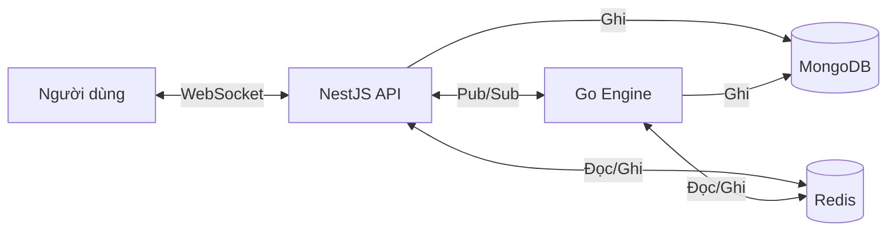

# Cross-Margin Redis Architecture — Exodia Core

Tài liệu thiết kế cách lưu trữ dữ liệu giao dịch Cross-Margin trên Redis.

---

## 1. Cross-Margin là gì?

Cross-Margin nghĩa là **tất cả tiền trong quỹ giao dịch (`tradeBalance`) được dùng chung cho mọi vị thế**.

Ví dụ: Bạn có 1000 USDT, mở 3 vị thế → cả 3 chia sẻ chung 1000 USDT này.

- ✅ Lời ở vị thế A bù lỗ cho vị thế B
- ⚠️ Nếu lỗ quá nặng → **thanh lý toàn bộ tài khoản** (không chỉ 1 vị thế)

---

## 2. Những con số cần theo dõi real-time

| Con số             | Ý nghĩa đơn giản                                 | Ai cập nhật?              |
| ------------------ | ------------------------------------------------ | ------------------------- |
| **Trade Balance**  | Số tiền thật trong tài khoản giao dịch           | MongoDB (source of truth) |
| **Unrealized PnL** | Lời/lỗ tạm tính của các lệnh đang mở (chưa đóng) | Go Engine (mỗi tick giá)  |
| **Total Equity**   | = Trade Balance + Unrealized PnL                 | Go Engine                 |
| **Margin Buffer**  | Số tiền còn lại trước khi bị thanh lý            | Go Engine                 |
| **Realized PnL**   | Lời/lỗ thật (đã đóng lệnh, đã cộng/trừ tiền)     | NestJS (khi đóng lệnh)    |

---

## 3. Redis lưu gì?

### 3.1 Thông tin tài khoản — `account:{wallet}`

```
KEY:  account:0xABC...
TYPE: Hash
```

| Field                    | Ví dụ     | Giải thích                                     |
| ------------------------ | --------- | ---------------------------------------------- |
| `tradeBalance`           | `"1000"`  | Copy từ MongoDB, đồng bộ khi mở/đóng lệnh      |
| `totalEquity`            | `"1050"`  | tradeBalance + tổng uPnL                       |
| `totalUnrealizedPnL`     | `"50"`    | Tổng lời/lỗ tạm tính                           |
| `totalInitialMargin`     | `"200"`   | Tổng tiền ký quỹ đang khóa                     |
| `totalMaintenanceMargin` | `"40"`    | Mức ký quỹ tối thiểu (dưới mức này → thanh lý) |
| `marginBuffer`           | `"1010"`  | = equity - maintenance margin                  |
| `marginRatio`            | `"0.038"` | = maintenance margin / equity (≥1 → thanh lý)  |
| `positionCount`          | `"3"`     | Số vị thế đang mở                              |

> [!IMPORTANT]
> `tradeBalance` trong Redis chỉ là **bản copy**. Số tiền thật luôn nằm ở MongoDB.

---

### 3.2 Vị thế đang mở — `positions:active:{wallet}`

```
KEY:  positions:active:0xABC...
TYPE: Hash
```

Mỗi field là 1 vị thế:

```
FIELD: "pos_12345"
VALUE: {
  "symbol": "BTC-USDT",
  "side": "long",
  "qty": 0.01,
  "entryPrice": 95000,
  "leverage": 10,
  "sl": 94000,
  "tp": 100000,

  // Go Engine tự cập nhật:
  "markPrice": 96000,
  "unrealizedPnL": 10,
  "initialMargin": 95,        // = (0.01 * 95000) / 10
  "maintenanceMargin": 3.84,  // = notional * MMR
  "liquidationPrice": 5200
}
```

---

### 3.3 Lệnh Limit chờ khớp — `orders:pending:{wallet}`

```
KEY:  orders:pending:0xABC...
TYPE: Hash
```

```
FIELD: "ord_67890"
VALUE: {
  "symbol": "ETH-USDT",
  "side": "short",
  "qty": 1,
  "entryPrice": 4000,
  "leverage": 5,
  "reservedMargin": 800   // = (1 * 4000) / 5 → đặt cọc trước
}
```

> [!WARNING]
> Lệnh Limit **phải đặt cọc trước** (`reservedMargin`). Nếu không, user có thể spam vô hạn lệnh mà không đủ tiền.

---

### 3.4 SL/TP trigger — Sorted Set (cho Go Engine tra nhanh)

```
KEY:   sl:triggers:BTC-USDT       // Cắt lỗ
TYPE:  Sorted Set
SCORE: giá trigger (VD: 94000)
MEMBER: "0xABC:pos_12345"
```

Thay vì scan toàn bộ, Go Engine chỉ cần query theo khoảng giá:

```
ZRANGEBYSCORE sl:triggers:BTC-USDT -inf 94500   → tìm SL cần kích hoạt
ZRANGEBYSCORE tp:triggers:BTC-USDT 100000 +inf   → tìm TP cần kích hoạt
```

---

### 3.5 Tổng hợp tất cả key Redis

```
account:{wallet}                → Tổng hợp tài khoản
positions:active:{wallet}       → Các vị thế đang mở
orders:pending:{wallet}         → Lệnh limit đang chờ
market:tickers                  → Giá thị trường (đã có sẵn)
lock:position:{wallet}          → Khóa chống race condition
sl:triggers:{symbol}            → SL trigger (Sorted Set)
tp:triggers:{symbol}            → TP trigger (Sorted Set)
```

---

## 4. Khi chưa có lệnh nào → Không cần Redis

Khi user không có vị thế nào đang mở:

- Unrealized PnL = 0
- Equity = Trade Balance (lấy thẳng từ MongoDB)
- Margin Buffer = Trade Balance

→ **Không cần tạo key nào trong Redis cả.**

### Lệnh đầu tiên xử lý thế nào?

```
1. User mở lệnh
2. NestJS kiểm tra Redis → Không có account:{wallet}
3. NestJS lấy tradeBalance từ MongoDB
4. Kiểm tra: tradeBalance >= margin cần + phí?
   → Có: tạo position + khởi tạo Redis keys
   → Không: từ chối lệnh
5. Go Engine bắt đầu monitor
```

### Khi nào xóa Redis?

Khi **đóng hết tất cả vị thế VÀ không còn lệnh pending** → xóa sạch 3 key:

```
DEL account:{wallet}
DEL positions:active:{wallet}
DEL orders:pending:{wallet}
```

---

## 5. Go Engine cập nhật Redis như nào?

**Mỗi khi có tick giá mới**, Go Engine:

1. Nhận giá mới (ví dụ BTC-USDT nhảy từ 95000 → 95100)
2. Tìm tất cả wallet đang có vị thế BTC-USDT
3. Tính lại uPnL, Equity, Margin Ratio **trong RAM của Go** (cực nhanh)
4. Ghi kết quả mới vào Redis
5. Bắn Pub/Sub để NestJS đẩy về frontend qua WebSocket

**Tối ưu hiệu năng:**

- **Pipelining**: Gom nhiều lệnh Redis thành 1 batch, gửi 1 lần
- **Throttle**: Tối đa 5-10 lần/giây/user (không cần cập nhật UI mỗi ms)
- **Selective**: Chỉ cập nhật Redis khi giá trị thay đổi đáng kể (> 0.1%)

---

## 6. Các vấn đề & giải pháp

### 6.1 🔒 Race Condition (Mở 2 lệnh cùng lúc)

**Vấn đề**: User gửi 2 lệnh đồng thời, cả 2 đều check "đủ tiền" → nhưng tổng lại thì không đủ.

**Giải pháp**: Dùng **Distributed Lock**. Mỗi lần mở/đóng/sửa lệnh phải "giành quyền" trước:

```typescript
const lockKey = `lock:position:${wallet}`;
const acquired = await redis.set(lockKey, uuid(), 'NX', 'EX', 5);
// NX = chỉ set nếu chưa tồn tại
// EX = tự expire sau 5 giây (tránh deadlock)

if (!acquired) throw new Error('Đang xử lý lệnh khác, thử lại sau');
```

---

### 6.2 🔄 Redis và MongoDB mất đồng bộ

**Vấn đề**: MongoDB ghi OK nhưng Redis chưa kịp cập nhật.

**3 lớp bảo vệ:**

| Lớp | Cơ chế                                                             | Khi nào chạy?        |
| --- | ------------------------------------------------------------------ | -------------------- |
| 1   | **Write-through**: Ghi MongoDB → ghi Redis. Nếu Redis fail → retry | Mỗi thao tác         |
| 2   | **Sync-on-startup**: Rebuild Redis từ MongoDB                      | Khi server khởi động |
| 3   | **Periodic check**: So sánh Redis vs MongoDB, sửa nếu lệch         | Mỗi 30 giây          |

---

### 6.3 💥 Redis Crash

**Vấn đề**: Redis restart → mất hết dữ liệu.

**Giải pháp:**

1. Bật **AOF** (ghi log mỗi giây) → mất tối đa 1 giây data
2. Khi Go Engine thấy Redis trống → tự động rebuild từ MongoDB
3. Go Engine ping Redis mỗi giây, mất kết nối → freeze mọi thao tác

---

### 6.4 ⚡ Thanh lý (Liquidation)

**Khi nào thanh lý?** Khi `Maintenance Margin ≥ Total Equity` (margin ratio ≥ 1).

```
Go Engine mỗi tick giá:
  1. Tính lại equity cho tất cả tài khoản
  2. marginRatio >= 0.8 → CẢNH BÁO (gửi WebSocket)
  3. marginRatio >= 1.0 → THANH LÝ (đóng vị thế lỗ nhất trước)
```

> [!CAUTION]
> Hiện tại `Pair` chưa có field `maintenanceMarginRate`. Cần thêm vào.
> Nên thiết kế theo tiers: notional nhỏ → MMR thấp, notional lớn → MMR cao.

---

### 6.5 🔢 Sai số thập phân

**Vấn đề**: `0.1 + 0.2 = 0.30000000000000004` (JavaScript/floating point).

**Giải pháp:**

- Redis lưu số dạng **string** (tránh mất precision)
- Go Engine dùng thư viện `shopspring/decimal` (tính chính xác)
- Luôn round về `BALANCE_CONFIG.PRECISION` trước khi ghi MongoDB

---

### 6.6 🛡️ Chống spam lệnh

| Giới hạn                | Giá trị gợi ý |
| ----------------------- | ------------- |
| Max lệnh pending / user | 20            |
| Max vị thế open / user  | 50            |
| Max lệnh / giây / user  | 5             |

Check nhanh trong Redis:

```
HLEN orders:pending:{wallet} < 20
HLEN positions:active:{wallet} < 50
```

---

### 6.7 📊 Funding Rate (nâng cao, triển khai sau)

Perpetual futures cần funding rate để giữ giá hợp đồng gần giá spot.

- Go Engine tính mỗi 8 giờ
- Funding = Giá trị vị thế × Funding Rate
- Cộng/trừ thẳng vào `tradeBalance`
- Lưu lịch sử vào MongoDB

---

### 6.8 🧩 Đóng lệnh một phần (Partial Close)

**Vấn đề**: Đóng 1 phần → PnL realized → `tradeBalance` đổi → margin ratio của tất cả lệnh khác cũng đổi.

**Giải pháp**: Dùng **Lua Script** để cập nhật **atomic** (tất cả cùng lúc, không có khoảng hở):

```lua
-- Cập nhật position + account summary cùng 1 lệnh
redis.call('HSET', KEYS[1], ARGV[1], ARGV[2])  -- position
redis.call('HSET', KEYS[2], 'tradeBalance', ARGV[3])  -- account
return 1
```

---

## 7. Công thức tính toán

### Unrealized PnL (lời/lỗ tạm tính)

```
Long:  uPnL = (giá hiện tại - giá vào) × số lượng
Short: uPnL = (giá vào - giá hiện tại) × số lượng
```

### Initial Margin (tiền ký quỹ)

```
IM = (số lượng × giá vào) / đòn bẩy

Ví dụ: Mua 0.1 BTC giá 95000, leverage 10x
IM = (0.1 × 95000) / 10 = 950 USDT
```

### Available Balance (số dư khả dụng, dùng để mở lệnh mới)

```
Available = tradeBalance + tổng uPnL - tổng IM - tổng reserved margin (lệnh pending)
```

### Margin Ratio (tỷ lệ ký quỹ, dùng để kiểm tra thanh lý)

```
Margin Ratio = tổng Maintenance Margin / Total Equity

>= 1.0 → THANH LÝ
>= 0.8 → CẢNH BÁO
```

### Liquidation Price (giá thanh lý)

```
Long:  Liq = giá vào - (equity - MM các lệnh khác) / số lượng
Short: Liq = giá vào + (equity - MM các lệnh khác) / số lượng
```

> [!NOTE]
> Trong Cross-Margin, giá thanh lý **phụ thuộc toàn bộ tài khoản**.
> Mở thêm/đóng bớt 1 lệnh → giá thanh lý của **tất cả lệnh khác** thay đổi.

---

## 8. NestJS và Go Engine giao tiếp thế nào?

Qua **Redis Pub/Sub** — giống như một "kênh radio" mà 2 bên cùng nghe:

### NestJS → Go Engine

| Sự kiện            | Khi nào?                   |
| ------------------ | -------------------------- |
| `POSITION_OPENED`  | User mở vị thế mới         |
| `POSITION_UPDATED` | User sửa SL/TP/đóng 1 phần |
| `POSITION_CLOSED`  | User đóng vị thế           |
| `ORDER_PLACED`     | User đặt lệnh limit        |
| `ORDER_CANCELLED`  | User hủy lệnh limit        |
| `BALANCE_UPDATED`  | User nạp/rút tiền          |

### Go Engine → NestJS

| Sự kiện                | Khi nào?                |
| ---------------------- | ----------------------- |
| `LIQUIDATION_WARNING`  | Margin ratio >= 0.8     |
| `LIQUIDATION_EXECUTED` | Đã thanh lý tài khoản   |
| `ORDER_FILLED`         | Lệnh limit đã khớp      |
| `SL_TP_TRIGGERED`      | SL hoặc TP đã kích hoạt |

### Kiến trúc tổng quan



---

## 9. Checklist

- [ ] Thêm `maintenanceMarginRate` vào `Pair` type
- [ ] Implement kiểm tra margin trước khi mở lệnh
- [ ] Implement distributed lock (chống race condition)
- [ ] Implement sync-on-startup (rebuild Redis từ MongoDB)
- [ ] Implement Lua script cho atomic updates
- [ ] Cấu hình Redis AOF persistence
- [ ] Implement reserved margin cho lệnh pending
- [ ] Implement rate limiting + giới hạn số lệnh
- [ ] Thiết kế SL/TP trigger bằng Sorted Set
- [ ] Implement Redis Pub/Sub cho NestJS ↔ Go Engine
- [ ] Design Go Engine (margin monitor, liquidation, SL/TP checker)

---

_MongoDB luôn là source of truth. Redis có thể bị xóa và rebuild lại bất cứ lúc nào._
